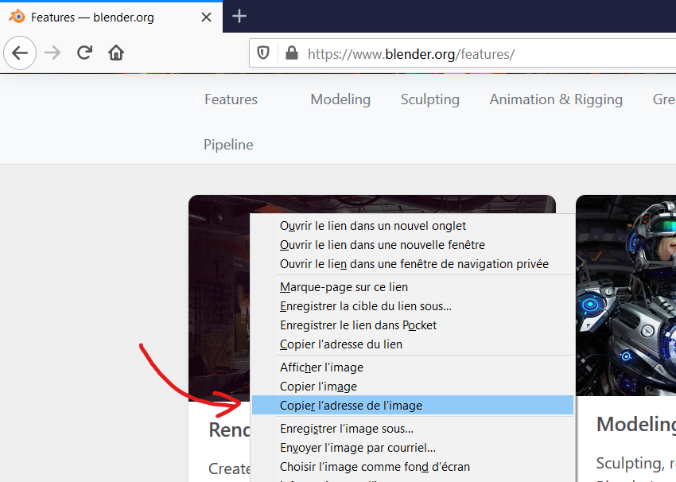
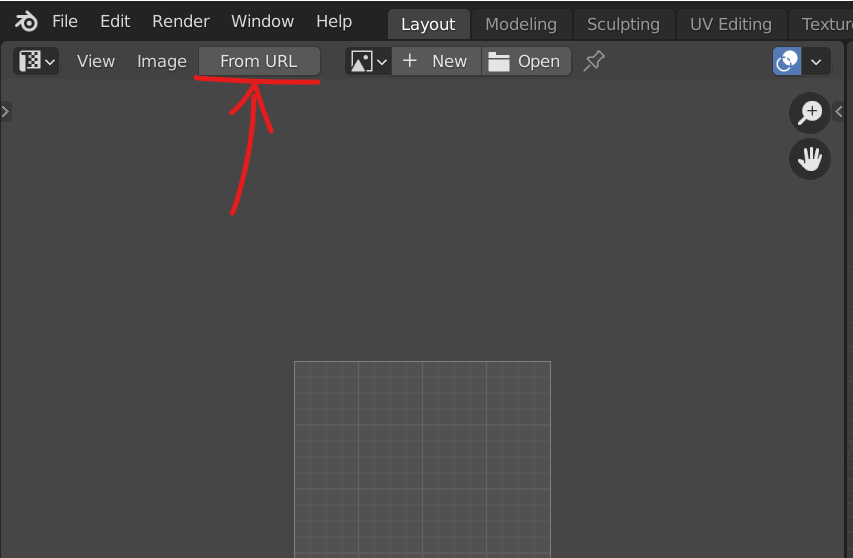
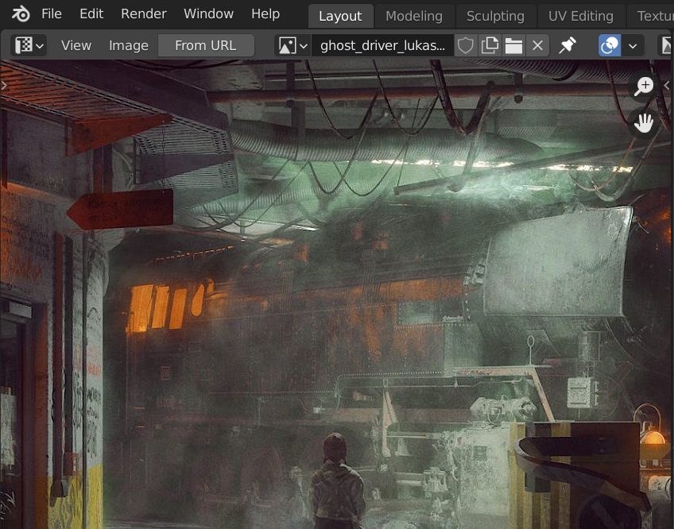

Lily Image From URL
===================

A very very simple Blender add-on to very very quickly import images from URLs.

Download
--------

Just download [LilyImageFromUrl.py]() from the last release.

Usage
-----

A. On any image on the Internet, right click, `Copy Image Address`:

B. In Blender, once the add-on is installed, click on the `From URL` button in the UV/Image Editor.

C. And voilà!

License
-------

This add-on is distributed under the terms of the GPLv3 license (see file header).

Troubleshooting
---------------

Any question is welcome either in the [bug tracker](https://github.com/eliemichel/LilyImageFromURL/issues) or on twitter [@exppad](https://twitter.com/exppad).

